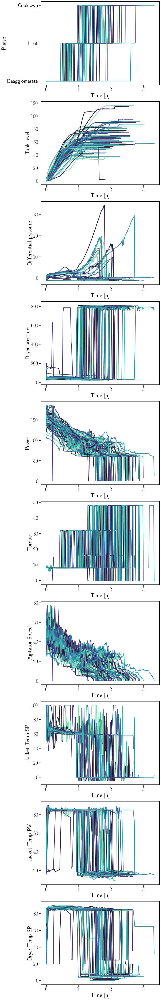

# **Batch Process Data Alignment Algorithms**

Use of chemometric algorithms requires that batch process data be first aligned, so as to obtain a square tridimensional matrix. Examples of three batch process data alignment algorithms are shown on this repository.

Reference: 
Arzac, I. I., Vallerio, M., Perez-Galvan, C., & Navarro-Brull, F. J. (2023). Industrial Data Science for Batch Reactor Monitoring and Fault Detection. In Machine Learning and Hybrid Modelling for Reaction Engineering (pp. 358–403). Royal Society of Chemistry. https://doi.org/10.1039/bk9781837670178-00358.

Credit for the dataset goes to Salvador Garcia Muñoz (2023), retrieved from https://github.com/salvadorgarciamunoz/pyphi.

#### **Import required packages and set figure style**


```python
import numpy as np
import pandas as pd
import matplotlib.pyplot as plt
import seaborn as sns
sns.set_context('talk',font_scale=1.5,rc={"lines.linewidth": 3})
sns.set_palette('mako')
plt.rcParams['text.usetex'] = True  # write label & legend in LaTex
from dtw import *
from scipy.signal import savgol_filter
from scipy.interpolate import CubicSpline, interp1d 
```

    Importing the dtw module. When using in academic works please cite:
      T. Giorgino. Computing and Visualizing Dynamic Time Warping Alignments in R: The dtw Package.
      J. Stat. Soft., doi:10.18637/jss.v031.i07.
    


#### **Retrieve and analyze the dataset**


```python
# Open the xlsx files
bdata  = pd.read_excel('Batch Dryer Case Study.xlsx',sheet_name='Trajectories')

# Remove all the columns with missing values. Name the new variable sensor_data_df
sensor_data_df = bdata.dropna()

# Time not given, only index. Assume that sensor measurements were recorded at regular intervals of 1 min; then convert units to hours
sensor_data_df = sensor_data_df.copy()     # Create a copy of the DataFrame to avoid SettingWithCopyWarning
sensor_data_df['Time [h]'] = np.zeros(len(sensor_data_df))

for j in sensor_data_df['Batch number'].unique():
    temporary_df = sensor_data_df.loc[sensor_data_df['Batch number'] == j].reset_index(drop=True)
    sensor_data_df.loc[sensor_data_df['Batch number'] == j,'Time [h]'] = temporary_df.index / 60 

# Analyze data visually
sensor_data_df
```


<div>
<style scoped>
    .dataframe tbody tr th:only-of-type {
        vertical-align: middle;
    }

    .dataframe tbody tr th {
        vertical-align: top;
    }

    .dataframe thead th {
        text-align: right;
    }
</style>
<table border="1" class="dataframe">
  <thead>
    <tr style="text-align: right;">
      <th></th>
      <th>Batch number</th>
      <th>Phase</th>
      <th>Tank level</th>
      <th>Differential pressure</th>
      <th>Dryer pressure</th>
      <th>Power</th>
      <th>Torque</th>
      <th>Agitator Speed</th>
      <th>Jacket Temp SP</th>
      <th>Jacket Temp PV</th>
      <th>Dryer Temp SP</th>
      <th>Dryer Temp</th>
      <th>Time [h]</th>
    </tr>
  </thead>
  <tbody>
    <tr>
      <th>0</th>
      <td>Batch 1</td>
      <td>Deagglomerate</td>
      <td>0.000</td>
      <td>0.648</td>
      <td>119.943</td>
      <td>127.302</td>
      <td>8.010</td>
      <td>39.515</td>
      <td>100.000</td>
      <td>18.697</td>
      <td>20.000</td>
      <td>19.614</td>
      <td>0.000000</td>
    </tr>
    <tr>
      <th>1</th>
      <td>Batch 1</td>
      <td>Deagglomerate</td>
      <td>0.156</td>
      <td>1.028</td>
      <td>62.902</td>
      <td>138.398</td>
      <td>8.010</td>
      <td>40.260</td>
      <td>100.000</td>
      <td>38.654</td>
      <td>41.161</td>
      <td>20.247</td>
      <td>0.016667</td>
    </tr>
    <tr>
      <th>2</th>
      <td>Batch 1</td>
      <td>Deagglomerate</td>
      <td>0.981</td>
      <td>1.218</td>
      <td>56.042</td>
      <td>141.096</td>
      <td>8.010</td>
      <td>37.370</td>
      <td>100.000</td>
      <td>57.419</td>
      <td>57.394</td>
      <td>22.018</td>
      <td>0.033333</td>
    </tr>
    <tr>
      <th>3</th>
      <td>Batch 1</td>
      <td>Deagglomerate</td>
      <td>1.856</td>
      <td>1.262</td>
      <td>56.431</td>
      <td>140.870</td>
      <td>8.010</td>
      <td>40.803</td>
      <td>100.000</td>
      <td>74.791</td>
      <td>76.874</td>
      <td>21.520</td>
      <td>0.050000</td>
    </tr>
    <tr>
      <th>4</th>
      <td>Batch 1</td>
      <td>Deagglomerate</td>
      <td>2.730</td>
      <td>1.332</td>
      <td>56.820</td>
      <td>136.792</td>
      <td>8.010</td>
      <td>35.893</td>
      <td>86.552</td>
      <td>89.337</td>
      <td>85.059</td>
      <td>21.886</td>
      <td>0.066667</td>
    </tr>
    <tr>
      <th>...</th>
      <td>...</td>
      <td>...</td>
      <td>...</td>
      <td>...</td>
      <td>...</td>
      <td>...</td>
      <td>...</td>
      <td>...</td>
      <td>...</td>
      <td>...</td>
      <td>...</td>
      <td>...</td>
      <td>...</td>
    </tr>
    <tr>
      <th>9264</th>
      <td>Batch 71</td>
      <td>Cooldown</td>
      <td>56.971</td>
      <td>-0.857</td>
      <td>756.503</td>
      <td>60.490</td>
      <td>48.010</td>
      <td>2.958</td>
      <td>0.000</td>
      <td>14.764</td>
      <td>4.073</td>
      <td>48.091</td>
      <td>1.700000</td>
    </tr>
    <tr>
      <th>9265</th>
      <td>Batch 71</td>
      <td>Cooldown</td>
      <td>56.971</td>
      <td>-0.880</td>
      <td>791.951</td>
      <td>60.335</td>
      <td>48.012</td>
      <td>2.380</td>
      <td>0.000</td>
      <td>14.637</td>
      <td>4.076</td>
      <td>46.018</td>
      <td>1.716667</td>
    </tr>
    <tr>
      <th>9266</th>
      <td>Batch 71</td>
      <td>Cooldown</td>
      <td>56.971</td>
      <td>-0.904</td>
      <td>769.646</td>
      <td>60.225</td>
      <td>48.015</td>
      <td>2.006</td>
      <td>0.000</td>
      <td>14.523</td>
      <td>4.080</td>
      <td>43.681</td>
      <td>1.733333</td>
    </tr>
    <tr>
      <th>9267</th>
      <td>Batch 71</td>
      <td>Cooldown</td>
      <td>56.971</td>
      <td>-0.917</td>
      <td>783.566</td>
      <td>57.595</td>
      <td>48.018</td>
      <td>1.801</td>
      <td>0.000</td>
      <td>14.473</td>
      <td>4.083</td>
      <td>41.310</td>
      <td>1.750000</td>
    </tr>
    <tr>
      <th>9268</th>
      <td>Batch 71</td>
      <td>Cooldown</td>
      <td>56.971</td>
      <td>-0.918</td>
      <td>777.113</td>
      <td>0.304</td>
      <td>-0.223</td>
      <td>-0.074</td>
      <td>82.160</td>
      <td>14.775</td>
      <td>25.000</td>
      <td>38.937</td>
      <td>1.766667</td>
    </tr>
  </tbody>
</table>
<p>9227 rows × 13 columns</p>
</div>


#### **Plot the unaligned process variable trajectories**


```python
variables = sensor_data_df.columns[1:-2]    # Plot every variable except the batch number and the batch time

def PlotUnalignedTrajectories():
    fig, ax = plt.subplots(len(variables),1,figsize=(10,85))
    for j in range(len(variables)):
        variable = variables[j]
        ax[j].set_ylabel(variable)
        ax[j].set_xlabel('Time [h]')
        #ax[j].legend(str(sensor_data_df['Batch number'].unique()))
        for i in sensor_data_df['Batch number'].unique(): 
            ax[j].plot(sensor_data_df.loc[(sensor_data_df['Batch number'] == i),'Time [h]'],sensor_data_df.loc[(sensor_data_df['Batch number'] == i),variable])

PlotUnalignedTrajectories()
```


    

    


## **Batch data alignment** 

## <span style="color:blue"> A) Alignment by <strong>Automation Triggers</span>

<div class="alert alert-block alert-info">
<b> Automation triggers are activated in changes between stages</b>, e.g. the closure of the valve feeding the tank when changing stage from <i>Deagglomerate</i> to <i>Heat</i>. <br><br>The alignment thus aligns per stage and linearly interpolates within, on this case on a [0,1] range per stage.
</div>


```python
sensor_data_df['Phase'].unique()  # There are three stages in this batch process, namely Deagglomerate, Heat and Cooldown

sensor_data_df['Aligned stage index'] = np.zeros(len(sensor_data_df))

for j in sensor_data_df['Batch number'].unique():
    stage = 0
    for k in sensor_data_df['Phase'].unique():
        stage_time = sensor_data_df.loc[(sensor_data_df['Batch number'] == j) & (sensor_data_df['Phase'] == k),'Time [h]']
        sensor_data_df.loc[(sensor_data_df['Batch number'] == j) & (sensor_data_df['Phase'] == k),'Aligned stage index'] = stage + (stage_time-min(stage_time))/(max(stage_time)-min(stage_time))   # linearly interpolate time from stage beginning to end
        stage += 1    # next aligned stage will start 1 unit later

for i in variables[1:]:
    fig_var, ax_var = plt.subplots(1,2, figsize=(18,8))
    a = sns.lineplot(data=sensor_data_df,x='Time [h]',y=i,hue='Batch number',ax=ax_var[0],legend=False, palette='mako')
    b = sns.lineplot(data=sensor_data_df,x='Aligned stage index',y=i,hue='Batch number',ax=ax_var[1],legend=False, palette='mako')
```


    

    


    

    


    

    


    

    


    

    


    

    


    

    


    

    


    

    


<div class="alert alert-block alert-warning">
If the aim of the batch data alignment is to apply some chemometric algorithm (e.g. PCA, PLS, etc.), then each stage needs to consist of an equal number of data points across batch runs.
</div>


```python
# Define the number of desired data points per stage
desired_data_points = 30  # Adjust this value as needed. Value should be high enough such that features of the process variable curves are not lost with the linear interpolation

# Create a new DataFrame to store the interpolated data
interpolated_sensor_data = pd.DataFrame()

# Iterate over unique batch numbers
for batch_number in sensor_data_df['Batch number'].unique():
    batch_data = sensor_data_df[sensor_data_df['Batch number'] == batch_number]
    
    # Iterate over unique stages
    stage_begin = 0 
    for stage in batch_data['Phase'].unique():
        stage_data = batch_data[batch_data['Phase'] == stage].copy()

        # Interpolate to achieve the desired number of data points
        interpolated_stage_data = pd.DataFrame()
        interpolated_stage_data['Aligned stage index'] = np.linspace(stage_begin, stage_begin+1, desired_data_points)
        for column in batch_data.columns:
            if column not in ['Batch number', 'Phase', 'Aligned stage index', 'Time [h]']:
                # Convert the column to numeric type before interpolation
                stage_data[column] = pd.to_numeric(stage_data[column], errors='coerce')
                interpolated_stage_data[column] = np.interp(
                    interpolated_stage_data['Aligned stage index'],
                    stage_data['Aligned stage index'],
                    stage_data[column]
                )
        
        # Add 'Batch number', 'Phase', and 'Time [h]' columns
        interpolated_stage_data['Batch number'] = batch_number
        interpolated_stage_data['Phase'] = stage
        interpolated_stage_data['Time [h]'] = np.interp(
            interpolated_stage_data['Aligned stage index'],
            stage_data['Aligned stage index'],
            stage_data['Time [h]']
        )
        
        interpolated_sensor_data = pd.concat([interpolated_sensor_data, interpolated_stage_data], ignore_index=True)

        stage_begin += 1


# 'interpolated_sensor_data' now contains the interpolated data with an equal number of data points per stage for each batch number
interpolated_sensor_data
```


<div>
<style scoped>
    .dataframe tbody tr th:only-of-type {
        vertical-align: middle;
    }

    .dataframe tbody tr th {
        vertical-align: top;
    }

    .dataframe thead th {
        text-align: right;
    }
</style>
<table border="1" class="dataframe">
  <thead>
    <tr style="text-align: right;">
      <th></th>
      <th>Aligned stage index</th>
      <th>Tank level</th>
      <th>Differential pressure</th>
      <th>Dryer pressure</th>
      <th>Power</th>
      <th>Torque</th>
      <th>Agitator Speed</th>
      <th>Jacket Temp SP</th>
      <th>Jacket Temp PV</th>
      <th>Dryer Temp SP</th>
      <th>Dryer Temp</th>
      <th>Batch number</th>
      <th>Phase</th>
      <th>Time [h]</th>
    </tr>
  </thead>
  <tbody>
    <tr>
      <th>0</th>
      <td>0.000000</td>
      <td>0.000000</td>
      <td>0.648000</td>
      <td>119.943000</td>
      <td>127.302000</td>
      <td>8.010000</td>
      <td>39.515000</td>
      <td>100.000000</td>
      <td>18.697000</td>
      <td>20.000000</td>
      <td>19.614000</td>
      <td>Batch 1</td>
      <td>Deagglomerate</td>
      <td>0.000000</td>
    </tr>
    <tr>
      <th>1</th>
      <td>0.034483</td>
      <td>1.101690</td>
      <td>1.224069</td>
      <td>56.095655</td>
      <td>141.064828</td>
      <td>8.010000</td>
      <td>37.843517</td>
      <td>100.000000</td>
      <td>59.815138</td>
      <td>60.080897</td>
      <td>21.949310</td>
      <td>Batch 1</td>
      <td>Deagglomerate</td>
      <td>0.035632</td>
    </tr>
    <tr>
      <th>2</th>
      <td>0.068966</td>
      <td>2.971379</td>
      <td>1.376690</td>
      <td>56.927310</td>
      <td>137.002483</td>
      <td>8.010000</td>
      <td>36.918103</td>
      <td>77.405517</td>
      <td>88.667483</td>
      <td>85.653483</td>
      <td>22.100621</td>
      <td>Batch 1</td>
      <td>Deagglomerate</td>
      <td>0.071264</td>
    </tr>
    <tr>
      <th>3</th>
      <td>0.103448</td>
      <td>4.875414</td>
      <td>1.558345</td>
      <td>57.800345</td>
      <td>135.129931</td>
      <td>8.011000</td>
      <td>39.911862</td>
      <td>64.961828</td>
      <td>82.943483</td>
      <td>86.707000</td>
      <td>23.753138</td>
      <td>Batch 1</td>
      <td>Deagglomerate</td>
      <td>0.106897</td>
    </tr>
    <tr>
      <th>4</th>
      <td>0.137931</td>
      <td>7.166724</td>
      <td>1.640310</td>
      <td>59.005621</td>
      <td>132.939034</td>
      <td>8.011000</td>
      <td>36.465690</td>
      <td>63.014655</td>
      <td>85.789862</td>
      <td>86.175172</td>
      <td>24.870828</td>
      <td>Batch 1</td>
      <td>Deagglomerate</td>
      <td>0.142529</td>
    </tr>
    <tr>
      <th>...</th>
      <td>...</td>
      <td>...</td>
      <td>...</td>
      <td>...</td>
      <td>...</td>
      <td>...</td>
      <td>...</td>
      <td>...</td>
      <td>...</td>
      <td>...</td>
      <td>...</td>
      <td>...</td>
      <td>...</td>
      <td>...</td>
    </tr>
    <tr>
      <th>6385</th>
      <td>2.862069</td>
      <td>56.971000</td>
      <td>-0.862793</td>
      <td>787.026034</td>
      <td>60.709310</td>
      <td>48.007517</td>
      <td>3.234414</td>
      <td>0.000000</td>
      <td>14.921241</td>
      <td>4.069690</td>
      <td>49.611276</td>
      <td>Batch 71</td>
      <td>Cooldown</td>
      <td>1.686207</td>
    </tr>
    <tr>
      <th>6386</th>
      <td>2.896552</td>
      <td>56.971000</td>
      <td>-0.865724</td>
      <td>769.948793</td>
      <td>60.431207</td>
      <td>48.010759</td>
      <td>2.738759</td>
      <td>0.000000</td>
      <td>14.715828</td>
      <td>4.074138</td>
      <td>47.304690</td>
      <td>Batch 71</td>
      <td>Cooldown</td>
      <td>1.706322</td>
    </tr>
    <tr>
      <th>6387</th>
      <td>2.931034</td>
      <td>56.971000</td>
      <td>-0.894069</td>
      <td>778.875655</td>
      <td>60.270517</td>
      <td>48.013759</td>
      <td>2.160759</td>
      <td>0.000000</td>
      <td>14.570172</td>
      <td>4.078345</td>
      <td>44.648034</td>
      <td>Batch 71</td>
      <td>Cooldown</td>
      <td>1.726437</td>
    </tr>
    <tr>
      <th>6388</th>
      <td>2.965517</td>
      <td>56.971000</td>
      <td>-0.914310</td>
      <td>780.686000</td>
      <td>58.139138</td>
      <td>48.017379</td>
      <td>1.843414</td>
      <td>0.000000</td>
      <td>14.483345</td>
      <td>4.082379</td>
      <td>41.800552</td>
      <td>Batch 71</td>
      <td>Cooldown</td>
      <td>1.746552</td>
    </tr>
    <tr>
      <th>6389</th>
      <td>3.000000</td>
      <td>56.971000</td>
      <td>-0.918000</td>
      <td>777.113000</td>
      <td>0.304000</td>
      <td>-0.223000</td>
      <td>-0.074000</td>
      <td>82.160000</td>
      <td>14.775000</td>
      <td>25.000000</td>
      <td>38.937000</td>
      <td>Batch 71</td>
      <td>Cooldown</td>
      <td>1.766667</td>
    </tr>
  </tbody>
</table>
<p>6390 rows × 14 columns</p>
</div>


<div class="alert alert-block alert-success">
Notice that the spacing between aligned stage index value is constant within each stage but varies between stages. This ensures that on later chemometric analysis longer stages are weighed heavier.

<br><br>
N.B. for the above the number of data points stored for each stage on 'interpolated_sensor_data' is the same. This will give equal weight to all stages on a three-way data chemometric analysis (e.g. MPCA or MPLS). If it desired to more heavily weight some stage, a larger number of data points may be interpolated and stored for this stage. This is the approach followed by Salvador Garcia Muñoz on his [pyphi library](https://github.com/salvadorgarciamunoz/pyphi).

<br><br>
Another possibility would be store interpolated data points per stage, relative to the ratio of median duration of the stages, so as to more heavily weight in our posterior analysis the fact that some stages last on average longer than others.
</div>

## <span style="color:blue"> B) Alignment based on <strong>Indicator Variable</span>

<div class="alert alert-block alert-info">
<b> Batch process data can be aligned by plotting the variable trajectories against a measured or inferred indicator variable which correlates with batch maturity or progress</b> (e.g. conversion). Such a variable has to be monotonically increasing or decreasing in time and show low noise levels, with the same start- and end-points across batches. 
<br><br>The variable trajectories have to be interpolated if they want to be plotted at equal intervals of the indicator variable, resulting in the same N time points per batch run. For batch processes with several automation steps a different indicator variable may be available per phase, in which case trajectory alignment is performed separately.
</div>


```python
# Three indicator variables (one per stage). Each stage is assumed to account for 33.3% of the progress of the batch. Within this 1/3 of the x axis, plot variables w.r.t. indicator variable
sensor_data_df['Stage'] = np.zeros(len(sensor_data_df))
for j in sensor_data_df['Batch number'].unique():
    deagglomerate = sensor_data_df.loc[(sensor_data_df['Batch number'] == j) & (sensor_data_df['Phase'] == 'Deagglomerate'),'Tank level']
    sensor_data_df.loc[(sensor_data_df['Batch number'] == j) & (sensor_data_df['Phase'] == 'Deagglomerate'),'Stage'] = 0 + (deagglomerate-min(deagglomerate))/(max(deagglomerate)-min(deagglomerate))
    heat = sensor_data_df.loc[(sensor_data_df['Batch number'] == j) & (sensor_data_df['Phase'] == 'Heat'),'Dryer Temp']
    sensor_data_df.loc[(sensor_data_df['Batch number'] == j) & (sensor_data_df['Phase'] == 'Heat'),'Stage'] = 1 + (heat-min(heat))/(max(heat)-min(heat))
    cooldown = sensor_data_df.loc[(sensor_data_df['Batch number'] == j) & (sensor_data_df['Phase'] == 'Cooldown'),'Dryer Temp']
    sensor_data_df.loc[(sensor_data_df['Batch number'] == j) & (sensor_data_df['Phase'] == 'Cooldown'),'Stage'] = 2 + (cooldown-max(cooldown))/(min(cooldown)-max(cooldown)) # susbtract max in the numerator since indicator variable is monotonically DECREASING on this stage

for i in variables:
    fig_var, ax_var = plt.subplots(1,2, figsize=(16,6))
    a = sns.lineplot(data=sensor_data_df,x='Time [h]',y=i,hue='Batch number',ax=ax_var[0],legend=False, palette='mako')t
    b = sns.lineplot(data=sensor_data_df,x='Stage',y=i,hue='Batch number',ax=ax_var[1],legend=False, palette='mako')
```


    

    


    

    


    

    


    

    


    

    


    

    


    

    


    

    


    

    


    

    


<div class="alert alert-block alert-warning">
Once again, if the aligned data will be used for PCA or PLS instead of just for visualization, an equal number of interpolated data points per stage is required across batches. The same code as was used for the automation trigger alignment can be used for this case.
</div>

## <span style="color:blue"> C) Alignment based on <strong>Dynamic Time Warping</span>

<div class="alert alert-block alert-info">
DTW searches for similar characteristics of two sets of variable trajectories based on a dynamic optimization scheme. <b>The trajectories are stretched and compressed so as to make them of equal length, while preserving the original data characteristics and aligning the landmark features.</b>

<br><br>
As opposed to the two previous algorithms, DTW requires the selection of a reference batch w.r.t. which the stretching of the signal is performed. The selected batch is typically the batch run with median duration among Normally Operating Condition batch runs. Notice below that the automation triggers do not necessarily align between batch runs. N.B.: these a simple showcase where all variables are asigned the same weight for warping. The algorithm can be tweaked to obtain a better alignment or to give a larger weight to some variable the process engineer finds of interest.
</div>


```python
# Get batch run time for each 'Batch number'
batch_run_time = sensor_data_df.groupby('Batch number')['Time [h]'].last().tolist()

# Select batch with the median duration (time) as reference and warp the rest with respect to this one
median_runtime = np.median(batch_run_time)   # median runtime for all batch runs
median_duration_run = min(batch_run_time, key=lambda x:abs(x-median_runtime))  # duration of the batch closest to the median time (consider that with even number the median is calcualted as (n/2+(n/2+1))/2, so this number will be different than if the median_runtime is odd, i.e., (batch_durations % 2) == 0
median_index = batch_run_time.index(median_duration_run) + 1  # determine the index of the run with the median duration. Add 1 to account for the 0-indexing of Python (the first batch number will be 1)

from new_step_patterns import *

# Change the local constraint to symmetricP0, symmetricP05, symmetricP1, symmetricP2, ..., symmetricP10 and then run the function to obtain the graphs
def DTW_alignment_plot():
    fig, axes = plt.subplots(nrows=len(variables),ncols=2,figsize=(18,len(variables)*8))

    for i in sensor_data_df['Batch number'].unique():   # iterate over the batch runs

        # Multivariate classical DTW
        try:
            query_cDTW = sensor_data_df.loc[sensor_data_df['Batch number'] == i, variables[1:]].to_numpy()
            reference_cDTW = sensor_data_df.loc[sensor_data_df['Batch number'] == 'Batch '+str(median_index), variables[1:]].to_numpy()   # extract the warping variable trajectory from the refrence data's batch number & the given stage number. Then convert to a numpy array to perform DTW
            alignment_cDTW = dtw(query_cDTW,reference_cDTW,keep_internals=True,open_end=False,step_pattern=symmetricP1,window_type=sakoeChibaWindow,window_args={'window_size': 100})   # First, perform a symmetric DTW with step_pattern='symmetric1', which favors diagonal steps
            wq_cDTW = warp(alignment_cDTW,index_reference=False)  # warp query. Set index_reference = False to warp the query instead of the reference. Multiple indices that would be mapped to a single point are averaged, with a warning. Gaps in the index sequence are filled by linear interpolation.
        except:
            pass
        
        for j, variable in enumerate(variables):
            # Plot the results
            axes[j,0].plot(range(len(sensor_data_df.loc[sensor_data_df['Batch number'] == i])),sensor_data_df.loc[sensor_data_df['Batch number'] == i,variable])   # unwarped query
            axes[j,1].plot(np.arange(len(wq_cDTW)),sensor_data_df.loc[sensor_data_df['Batch number'] == i,variable].reset_index(drop=True)[wq_cDTW])  # warped query
            axes[j, 0].set_xlabel('Batch time index'), axes[j, 0].set_ylabel(f'Original {variable}')
            axes[j, 1].set_xlabel('Batch time index'), axes[j, 1].set_ylabel(f'Warped {variable}')

DTW_alignment_plot()
```


    

    


<div class="alert alert-block alert-warning">
The classical DTW warps the signal based on its absolute value, which in some instances might cause undesired extreme time distorsion. This can be solved by applying DTW to the derivative of the signal, so as to align based on the signal's shape. This is referred to as Derivative DTW.
</div>


```python
# Robust Derivative DTW
def RDDTW_alignment_plot():
    fig, axes = plt.subplots(nrows=len(variables),ncols=2,figsize=(18,len(variables)*8))

    delta_t = sensor_data_df.loc[sensor_data_df['Batch number']=='Batch '+str(median_index),'Time [h]'].iloc[1-0] # calculate the ∆t for the finite forward derivatives. Also consider that ∆t is the same as samples were measured every 120 s

    for i in sensor_data_df['Batch number'].unique():   # iterate over the batch runs
        for j, variable in enumerate(variables):
            try:
                # Multivariate robust derivative DTW
                query = sensor_data_df.loc[sensor_data_df['Batch number'] == i, variables[1:]].to_numpy()
                filtered_query = savgol_filter(query,window_length=7,polyorder=5)
                query_diff = np.diff(filtered_query)/delta_t
                reference = sensor_data_df.loc[sensor_data_df['Batch number'] == 'Batch '+str(median_index), variables[1:]].to_numpy()  # extract the warping variable trajectory from the refrence data's batch number & the given stage number. Then convert to a numpy array to perform DTW
                filtered_reference = savgol_filter(reference,window_length=7,polyorder=5)
                reference_diff = np.diff(filtered_reference)/delta_t
                alignment_rdDTW = dtw(query_diff,reference_diff,keep_internals=True,open_end=False,step_pattern=symmetricP1,window_type=slantedBandWindow,window_args={'window_size': 100})   # First, perform a symmetric DTW with step_pattern='symmetric1', which favors diagonal steps
                wq_rdDTW = warp(alignment_rdDTW,index_reference=False)  # warp query. Set index_reference = False to warp the query instead of the reference. Multiple indices that would be mapped to a single point are averaged, with a warning. Gaps in the index sequence are filled by linear interpolation.
            except:
                pass 

            # Plot the results
            axes[j, 0].plot(range(len(sensor_data_df.loc[sensor_data_df['Batch number'] == i])),sensor_data_df.loc[sensor_data_df['Batch number'] == i,variable])   # unwarped query
            axes[j, 1].plot(np.arange(len(wq_rdDTW)),sensor_data_df.loc[sensor_data_df['Batch number'] == i,variable].reset_index(drop=True)[wq_rdDTW])  # warped query
            axes[j, 0].set_xlabel('Batch time index'), axes[j, 0].set_ylabel(f'Original {variable}')
            axes[j, 1].set_xlabel('Batch time index'), axes[j, 1].set_ylabel(f'Warped {variable}')


RDDTW_alignment_plot()
```


    

    


<div class="alert alert-block alert-success">
Another possibility to tweak the alignment is the selection of the local constraint P. At P=0, the most extreme warping of the time index will be allowed, whereas at P=abs(len(query)-len(reference)) a linear interpolation of the entire batch run will be performed. All P values in between consist of a combination of these two.
</div>


```python
sns.set_palette("coolwarm",n_colors=9)

def effects_of_increasing_P():
    fig, axes = plt.subplots(nrows=1,ncols=2,figsize=(16,8))
    for ax in axes:
        ax.set_xlabel('Batch time index'), ax.set_ylabel('Dryer Temperature [$^{o}C$]')

    # Univariate classical DTW
    query_cDTW = sensor_data_df.loc[sensor_data_df['Batch number'] == 'Batch 16', 'Dryer Temp'].to_numpy()
    reference_cDTW = sensor_data_df.loc[sensor_data_df['Batch number'] == 'Batch '+str(median_index), 'Dryer Temp'].to_numpy()   # extract the warping variable trajectory from the refrence data's batch number & the given stage number. Then convert to a numpy array to perform DTW

    for local_constraint_P in [symmetricP7,symmetricP6,symmetricP5,symmetricP4,symmetricP3,symmetricP2,symmetricP1,symmetricP05,symmetricP0]:   # iterate over the batch runs
        try:
            alignment_cDTW = dtw(query_cDTW,reference_cDTW,keep_internals=True,open_end=False,step_pattern=local_constraint_P,window_type=sakoeChibaWindow,window_args={'window_size': 100})   # First, perform a symmetric DTW with step_pattern='symmetric1', which favors diagonal steps
            wq_cDTW = warp(alignment_cDTW,index_reference=False)  # warp query. Set index_reference = False to warp the query instead of the reference. Multiple indices that would be mapped to a single point are averaged, with a warning. Gaps in the index sequence are filled by linear interpolation.

            # Plot the results
            axes[1].plot(np.arange(len(wq_cDTW)),sensor_data_df.loc[sensor_data_df['Batch number'] == 'Batch 16','Dryer Temp'].reset_index(drop=True)[wq_cDTW])  # warped query
            axes[1].legend(['P = 7','P = 6','P = 5','P = 4','P = 3','P = 2','P = 1','P = 0.5','P = 0'],loc='center left', bbox_to_anchor=(1, 0.5),prop={'size': 18})

        except:
            pass

    # Plot unwarped reference and query signals
    axes[0].plot(query_cDTW,color='blue')
    axes[0].plot(reference_cDTW,color='red')
    axes[0].legend(['Unwarped signal','Reference'],prop={'size': 18})

effects_of_increasing_P()
```


    

    


```python

```
